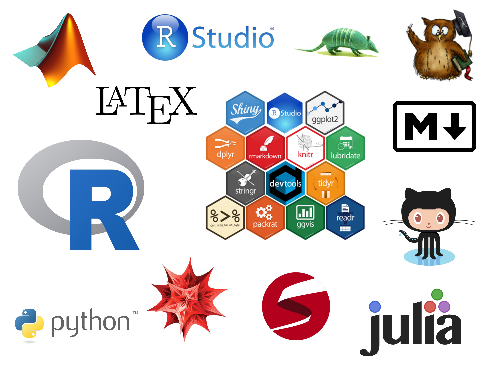

## What?

A series of **informal sessions among coding enthusiasts**, with a common interest in tools for crunching data, performing statistical analyses and reporting them. Quite `R`-based but definitely open to other languages/tools of interest.

## Who?

Members of the Department of Statistics (professors, postdocs, PhD students, MSc students) and other departments (Mathematics, Economics, Computer Science and Engineering, etc). Any person with interest in coding is welcome to join.

## When?

Biweekly or triweekly sessions, see the [calendar](https://codingclubuc3m.github.io/calendar.html) for more info.

## Where?

At the Department of Statistics, either in Leganés or Getafe. <!--The proportion of meetings in Getafe/Leganés will be according to the proportion of participants from each campus.-->

## Why?

Because:

- We **like coding and keeping up-to-date** in the most recent advances and methodologies.
- We want to **exchange knowledge** between colleagues and benefit from their expertise.
- We look forward to learn **better tools for teaching and presenting results**.
<!-- - We want to receive and provide **feedback** on how to approach **programming problems**. -->
- It is funnier to learn with more people than on your own!

## How?

Sessions to be held in a room equipped with a projector and spots for laptops. The idea is that attendees bring their own laptops to the session and are able to follow the reproducible codes. The main topic of the session is communicated by email a week before.

## Session duration

The sessions are scheduled for **60 minutes**, with a strong compromise to keep the duration of the session at this limit.

## Session structure

One speaker presents a topic he/she may think it is of interest using materials with reproducible code. Attendees follow the materials and may ask questions or doubts on the go. The presentation is informal and the speaker's goal is to deliver the key insights behind the code, useful tricks and patches to common errors.

<!--
A possible one is:

1. **Introduction** (~5 minutes). Presentation and quick overview of the session's scope.
2. **Main topic** (~30). Interactive presentation of a specific topic at a introductory, intermediate or advanced level.
3. **Feedback for problem solving** (~10). Tell us how are you solving or trying to solve a current problem to gain advice from the rest.
4. **Miscellanea tricks** (~5). Did you find a solution for a tricky problem or a great productivity hack? You can tell us about it, if you think is useful.
5. **Proposals for next sessions** (~10). We vote and discuss what are the most interesting topics for the next sections, based on a list of common interests and available presenters.
-->

## Visibility

The materials for each session are hosted in this website as posts. Each post will be solely authored by the presenter, hence providing a proof of participation. Also, the post may contain possible follow-ups and comments to the sessions.

## Sounds good? Then join us!

We are looking for speakers that are willing to contribute a main topic presentation at some point. If you are interested, then please fill in [this form](https://docs.google.com/forms/d/e/1FAIpQLSesu_kvqzmwqZc4m25_WygeBJLjeaLCYRk45XiS96T_HHsGcQ/viewform?usp=sf_link). 

## Topics suggestions

If you want to contribute a talk and are looking for inspiration, you may want to consider some suggestions (~~strikeout~~ text means the topic was already covered) of topics that could be of interest to the participants. Also, feel free to suggest topics in which you are interested that are not listed here!

1. About `R` packages:
    
    - [animation](https://cran.r-project.org/web/packages/animation)
    - [dplyr](https://cran.r-project.org/web/packages/dplyr)
    - [foreach](https://cran.r-project.org/web/packages/foreach) (with parallelization)
    - [ggplot2](https://cran.r-project.org/web/packages/ggplot2)
    - [magrittr](https://cran.r-project.org/web/packages/magrittr)
    - [Matrix](https://cran.r-project.org/web/packages/Matrix)
    - [matrixcalc](https://cran.r-project.org/web/packages/matrixcalc)
    - [memoise](https://cran.r-project.org/web/packages/memoise)
    - ~~[microbenchmark](https://cran.r-project.org/web/packages/microbenchmark)~~
    - [Rcpp](https://cran.r-project.org/web/packages/Rcpp)
    - [RcppArmadillo](https://cran.r-project.org/web/packages/RcppArmadillo)
    - [RcppEigen](https://cran.r-project.org/web/packages/RcppEigen)
    - [readr](https://cran.r-project.org/web/packages/readr)
    - [rgl](https://cran.r-project.org/web/packages/rgl)
    - [rmarkdown](https://cran.r-project.org/web/packages/rmarkdown)
    - [Rmpfr](https://cran.r-project.org/web/packages/Rmpfr)
    - [roxygen2](https://cran.r-project.org/web/packages/roxygen2)
    - ~~[Shiny](https://cran.r-project.org/web/packages/shiny)~~
    - [SimDesign](https://cran.r-project.org/web/packages/SimDesign) or [simTool](https://cran.r-project.org/web/packages/simTool)
    - [stringr](https://cran.r-project.org/web/packages/stringr)
    - [tidyr](https://cran.r-project.org/web/packages/tidyr)
    - ~~[txtplot](https://cran.r-project.org/web/packages/txtplot)~~

2. About more general topics:

    - ~~Introduction to [Julia](http://julialang.org/)~~
    - Introduction to [Mathematica](https://www.wolfram.com/mathematica/)
    - Introduction to [Python](https://www.python.org/)
    - Introduction to [Stan](http://mc-stan.org/)
    - How to develop efficiently with [GitHub](https://github.com/)

## Contact

Send an email to <coding.club.uc3m@gmail.com>

## License

All material in this website is licensed under [CC BY-NC-SA 4.0](https://creativecommons.org/licenses/by-nc-sa/4.0/).
